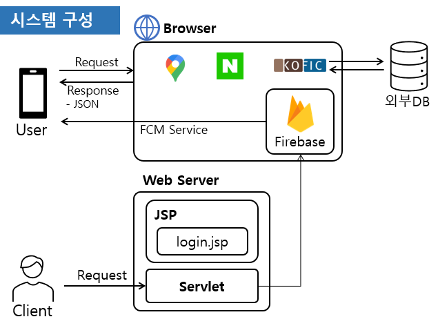
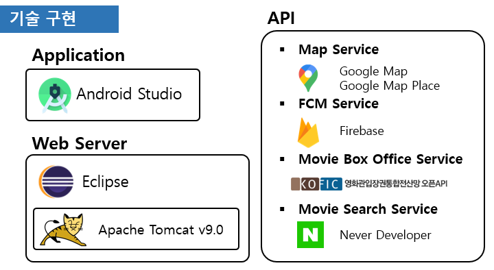
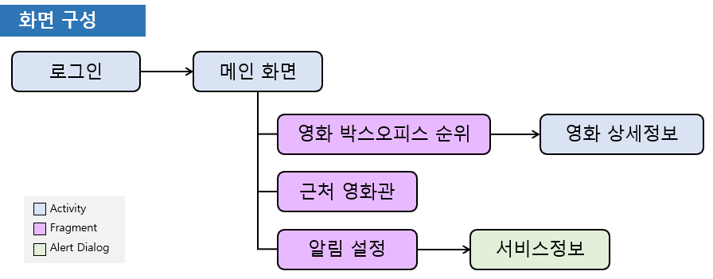
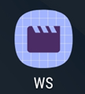
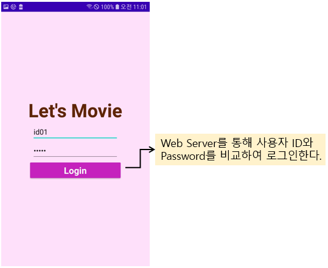
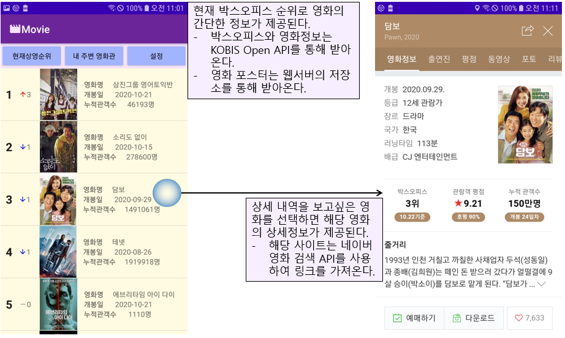
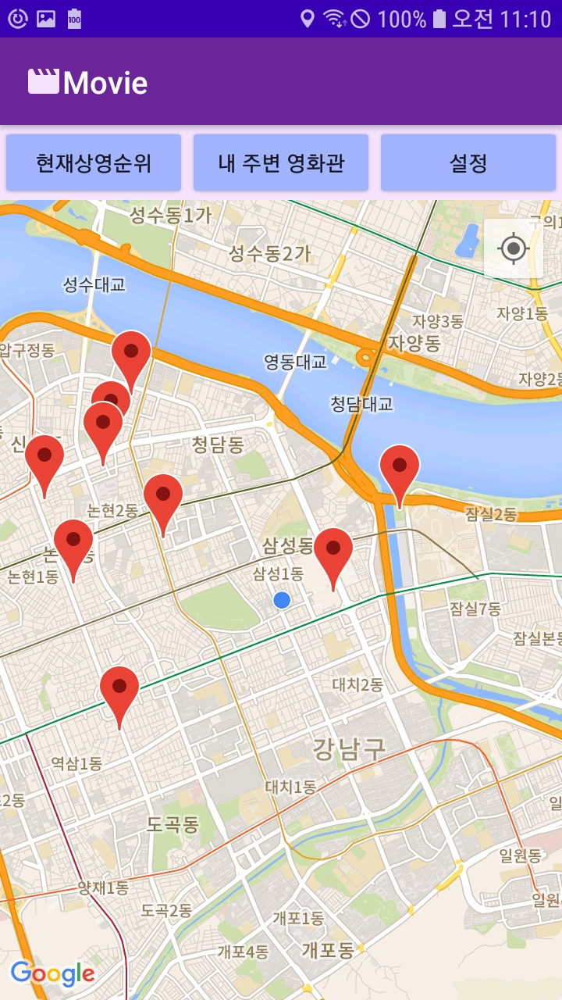
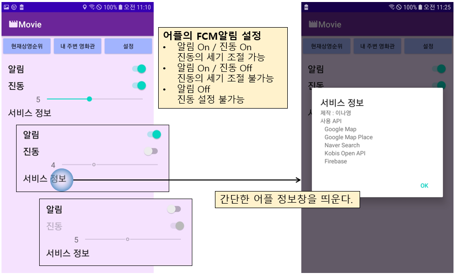
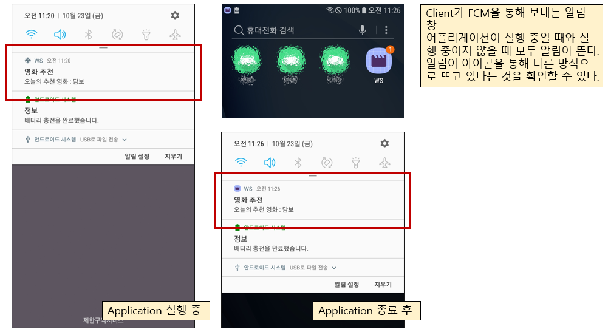

# Let's Movie

## 1. 기획내용

1. 영화 관련 서비스 어플리케이션으로 현재의 영화 박스오피스 순위, 상세내역을 보여준다.
2. 사용자의 위치를 기반으로 지도를 통해 근처의 영화관을 표시해 알려준다.
3. FCM서비스를 이용해 클라이언트는 사용자에게 영화를 추천하는 알림을 보낸다.
4. 사용자는 알림 On/Off, 알림의 진동을 조절할 수 있다.

* 제작 기간 2020.10.22 - 2020.10.23 (2일)

## 2. 시스템 구성도



## 3. 구현기술

* Android Studio
  * 언어 : Java, xml, JSON
  * API : Google Map, Google Map Place API, Naver Search API, Kobis OpenAPI, Firebase(FCM)
* Eclipse
  * 언어 : Java, HTML, JSON
  * Apache Tomcat v9.0, JSP, Firebase(FCM)



## 4. 구현 내용

* 어플리케이션 화면 구성

  

* 로그인

  * 웹서버의 login.jsp를 이용하여 로그인 정보를 받아 구현
  * code일부 (MainActivity.java)

  ```java
  public void ckLogin(View v) {
      ConnectivityManager cm =
              (ConnectivityManager)getApplication().getSystemService(Context.CONNECTIVITY_SERVICE);
  
      NetworkInfo activeNetwork = cm.getActiveNetworkInfo();
      boolean isConnected = activeNetwork != null &&
              activeNetwork.isConnectedOrConnecting();
      if(isConnected){
          String id = u_id.getText().toString();
          String pwd = u_pwd.getText().toString();
          String url = "http://"+Contants.IP_NUM+"/android/login.jsp";
          url += "?id="+id+"&pwd="+pwd;
          Log.d(Contants.LOG_TAG, url);
          httpAsync = new HttpAsync();
          httpAsync.execute(url);
      }
  }
  ```

* 메인 화면

  * ActionBar를 Application 분위기와 통합.
  * Fragment를 이용하여 여러 서비스들을 제공하였다.
  * Fragment 화면 제어 Code 일부(SecondActivity.java)

  ```java
  public void ckBtn(View v){
  
      FragmentTransaction transaction = getSupportFragmentManager().beginTransaction();
      if(v.getId()==R.id.listBtn){
          movieListFragment = new MovieListFragment();
          transaction.replace(
                  R.id.fragment, movieListFragment
          ).commit();
      }else if(v.getId()==R.id.mapBtn){
          mapsFragment = new MapsFragment();
          transaction.replace(
                  R.id.fragment, mapsFragment
          ).commit();
      }else if(v.getId() == R.id.setBtn){
          settingFragment = new SettingFragment();
          transaction.replace(
                  R.id.fragment, settingFragment
          ).commit();
      }
  }
  ```

* 메인 화면 – 영화 박스오피스 순위

  * API를 통해 영화 boxoffice데이터를 가져온다.
  * 받아온 JSON데이터를 Movie객체로 변환하여 뿌리는 Code(MovieListFragment.java)

  ```java
  @Override
  protected void onPostExecute(String s) {
      progressDialog.dismiss();
      try {
          JSONObject j = new JSONObject(s);
  
          JSONObject j1 = j.getJSONObject("boxOfficeResult");
  
          JSONArray ja = j1.getJSONArray("dailyBoxOfficeList");
          for(int i=0;i<ja.length();i++){
              JSONObject jo = ja.getJSONObject(i);
              String movieNm = jo.getString("movieNm");
              String movieCd = jo.getString("movieCd");
              String rank = jo.getString("rank");
              String openDt = jo.getString("openDt");
              String rankInten = jo.getString("rankInten");
              String audiAcc = jo.getString("audiAcc");
              Movie item = new Movie(rank,rankInten,movieCd,movieNm,openDt,audiAcc);
              list.add(item);
              Log.d(Contants.LOG_TAG,"Get Movie:"+movieCd+","+movieNm);
          }
      } catch (JSONException e) {
          e.printStackTrace();
      }
      ItemAdapter itemAdapter = new ItemAdapter();
      listView.setAdapter(itemAdapter);
  
  }
  ```

  * List에서 영화를 선택했을 때 영화의 링크를 엑티비티를 띄워 보여준다.
  * 엑티비티에서 링크를 받아 띄우는 Code (MovieActivity.java)

  ```java
  @Override
      protected void onCreate(Bundle savedInstanceState) {
  
          (생략)
  
          Intent intent = getIntent();
          final String movieName = intent.getExtras().getString(Contants.MOVIE_NAME);
  
          link = null;
          webView = findViewById(R.id.webView);
          WebSettings webSettings = webView.getSettings();
          webSettings.setJavaScriptEnabled(true);
  
          webView.setWebViewClient(new ViewClient());
  
  
          Thread thread = new Thread() {
              public void run() {
                  ApiNaver api = new ApiNaver();
                  link = api.main(movieName);
                  link = link.substring(8);
                  link = "http://m."+link;
                  Log.d(Contants.LOG_TAG,link);
  
                  webView.post(new Runnable() {
                      @Override
                      public void run() {
                          cView(link);
                      }
                  });
              }
          };
          thread.setDaemon(true);
          thread.start();
  
          Log.d(Contants.LOG_TAG,movieName);
      }
  ```

* 메인 화면 – 근처 영화관

  * 현재 위치를 받아온다.
  * -> Google Map을 이용하여 현재 위치를 띄워준다.
  * -> Google Map Place API를 이용하여 현재 위치 근처의 영화관 정보를 받아온 후 마커를 표시한다.
  * Google Map Place API를 이용해 위치정보를 가져오는 코드 일부(MapsFragment.java)

  ```java
  public void showPlaceInformation(LatLng location)
  {
      gmap.clear();//지도 클리어
  
      if (previous_marker != null)
          previous_marker.clear();//지역정보 마커 클리어
  
      new NRPlaces.Builder()
              .listener(this)
              .key(Contants.GOOGLE_PLACE_API_KEY)//API Key
              .latlng(location.latitude, location.longitude)//현재 위치
              .radius(2500) //2500 미터 내에서 검색
              .type(PlaceType.MOVIE_THEATER) //영화관
              .build()
              .execute();
  }
  ```

* 메인 화면 – 알림 설정

  * 앱을 종료 후 다시 켰을 때도 알림에 대한 정보가 저장되기 위해 SharedPreferences를 이용하였다.
  * 어플에 대한 간단한 정보를 AlertDialog를 이용하여 띄운다.
  * SharedPreferences를 이용하여 기존 값을 불러와 화면을 셋팅하는 Code일부 (SettingFragment.java)

  ```java
  @Override
  public View onCreateView(LayoutInflater inflater, ViewGroup container,
                           Bundle savedInstanceState) {
      (생략)
  
      sp = getActivity().getSharedPreferences(Contants.SETTING, MODE_PRIVATE);
      boolean noti = sp.getBoolean(Contants.SETTING_NOTICE,true);
      boolean vibe = sp.getBoolean(Contants.SETTING_VIBE,true);
      notiSwitch.setChecked(noti);
      if(!noti){
          vibeSwitch.setClickable(false);
          vibeSwitch.setEnabled(false);
          vibeSeek.setEnabled(false);
      }else{
          vibeSwitch.setChecked(vibe);
          vibeSwitch.setEnabled(true);
          if(!vibe){
              vibeSeek.setEnabled(false);
          }else {
              vibeSeek.setEnabled(true);
          }
      }
      (생략)
  }
  ```

* 웹서버

  * Firebase를 이용하여 JSON데이터를 사용자에게 전달한다.
  * Title과 Body 데이터를 이용한 JSON값 설정 Code 일부

  ```java
  JSONObject notification = new JSONObject();
  notification.put("title", "영화 추천");
  notification.put("body", "오늘의 추천 영화 : 담보");
  message.put("notification", notification);
  ```


## 5. 구현 결과

* 어플리케이션 로고

  

* 로그인

  

* 메인 화면 - 영화 박스오피스 순위

  

* 메인 화면 - 근처 영화관



* 메인 화면 - 알림 설정

  

* 영화 추천 알림

  * FCM Service를 이용

  

